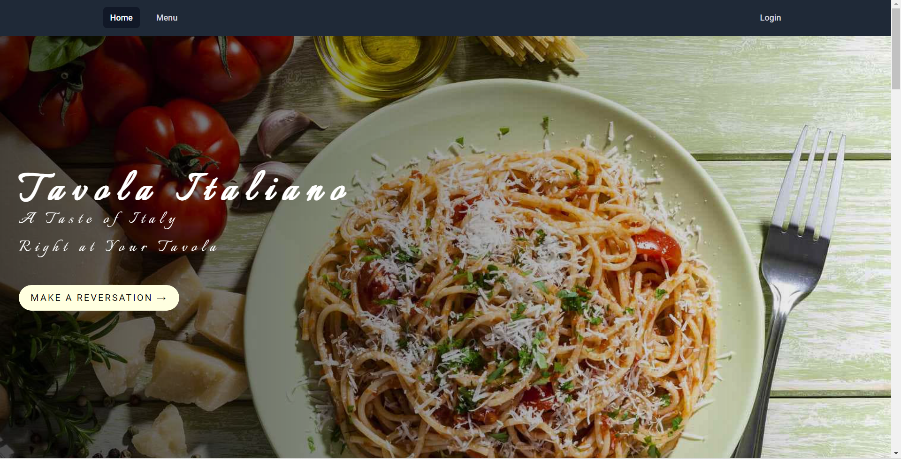
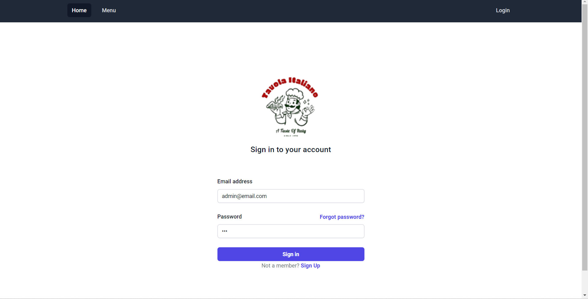
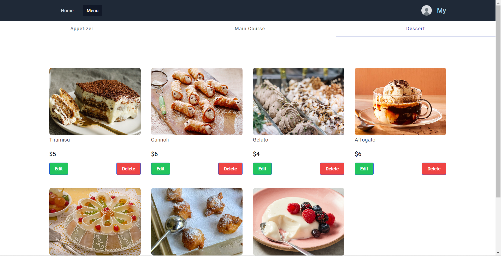

# TavolaItaliano

Welcome to our Restaurant Website's repository! This is a simple place for everyone who loves our food. Here, you can check out our menu, book a table, and update your own profile. Enjoy! 🍽️🍷

# Features

## Users:

### Menu Exploration:
- View our diverse range of dishes and specials.

### Reservation:
- Make a table reservation for your preferred date and time.
Access your reservation history anytime.

### Profile Management:
- Edit personal details for a tailored experience.
Update your avatar to personalize your profile.

### Authentication:
- Secure sign in and sign up options.
Auto login and auto logout features for convenience and security.

## Admin:

### Menu Management: 
- Add, update, or remove items from the menu to keep it fresh and current

### Reservation Management: 
- Oversee all reservations, manage timings, or make necessary updates.

# Tech Stack & Libraries:
This project is built using Angular, Tailwind CSS, Node.js, MySQL and a combination of popular libraries and middlewares and other technologies:

- Express.js: Fast, unopinionated web application framework.
- Mongoose: Elegant MongoDB object modeling for Node.js.
- body-parser: Middleware to parse incoming request bodies.
- cors: Middleware to enable CORS with various options.
- multer: Middleware for handling multipart/form-data, which is primarily used for uploading files.
- jsonwebtoken (JWT): An implementation of JSON Web Tokens.
- crypto: Provides cryptographic functionality for secure data handling.
- Tailwind CSS: Responsive front-end framework.
- Angular Material: simple front-end interface for admin management.
- Azure Database for MySQL: Hosting MySQL database.
- Google Bucket: Storing images.

# Getting Started

## Clone the Repository:
- git clone https://github.com/phthien241/Restaurant-TavolaItaliano
- cd Travel-Website-Voyage-Vista
## Install Dependencies:
- npm install
## Configuration:
- Configure your own MySQL server in database file.
## Start the Application:
- run node server.js
- run ng serve

# Demo

